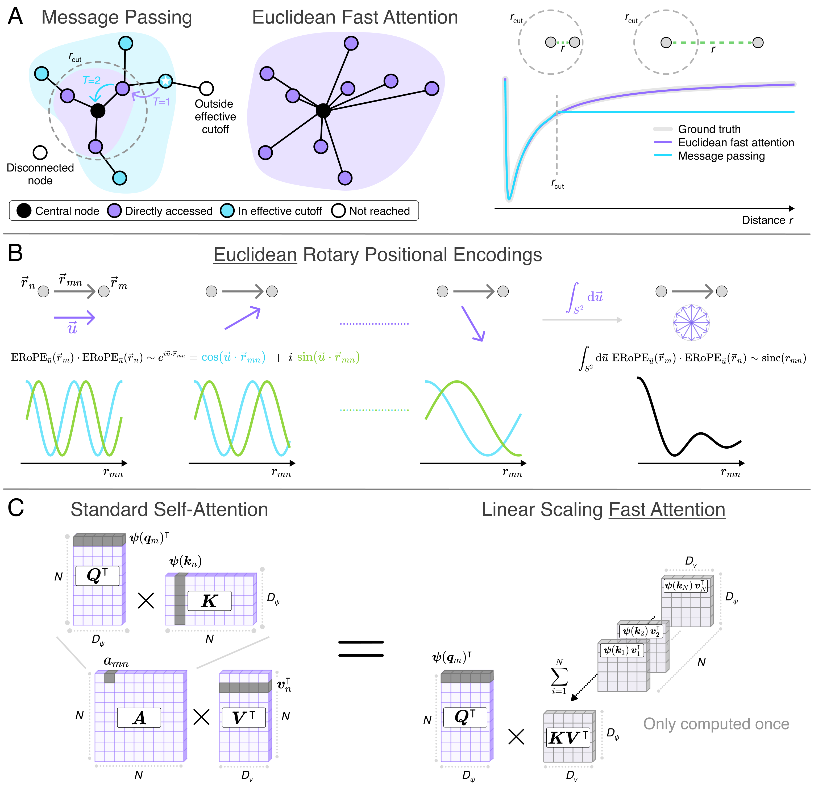
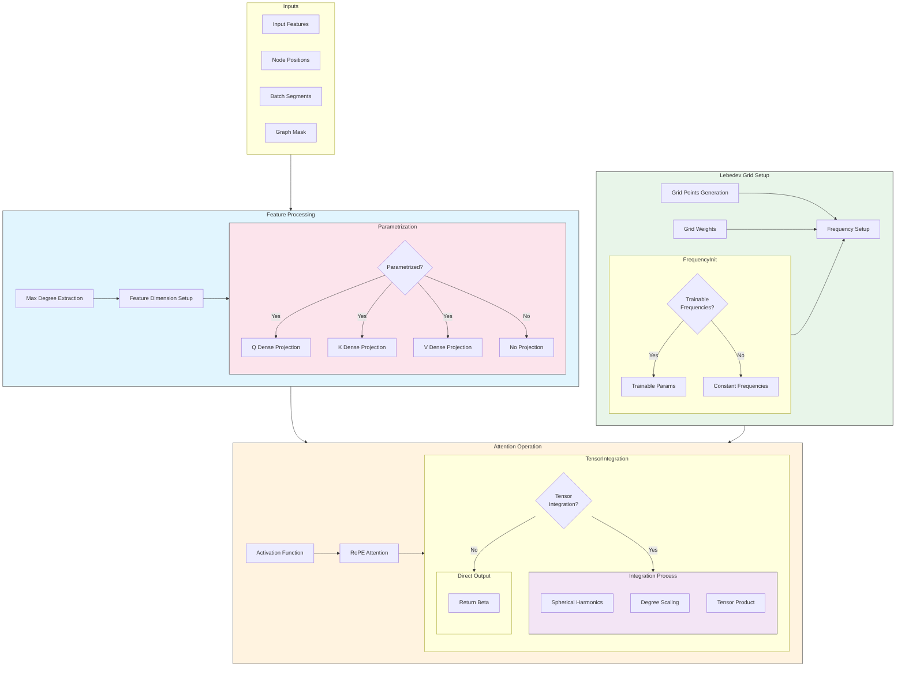
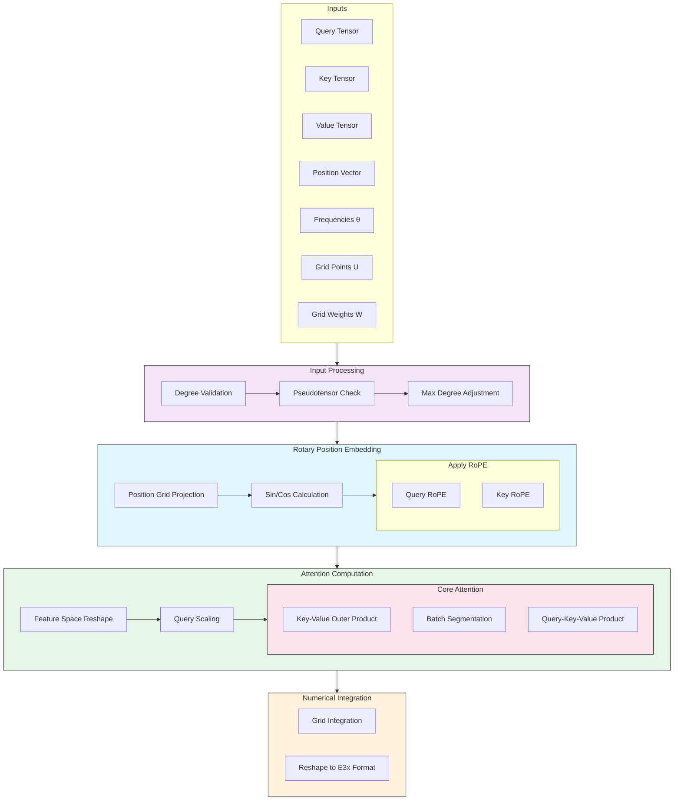
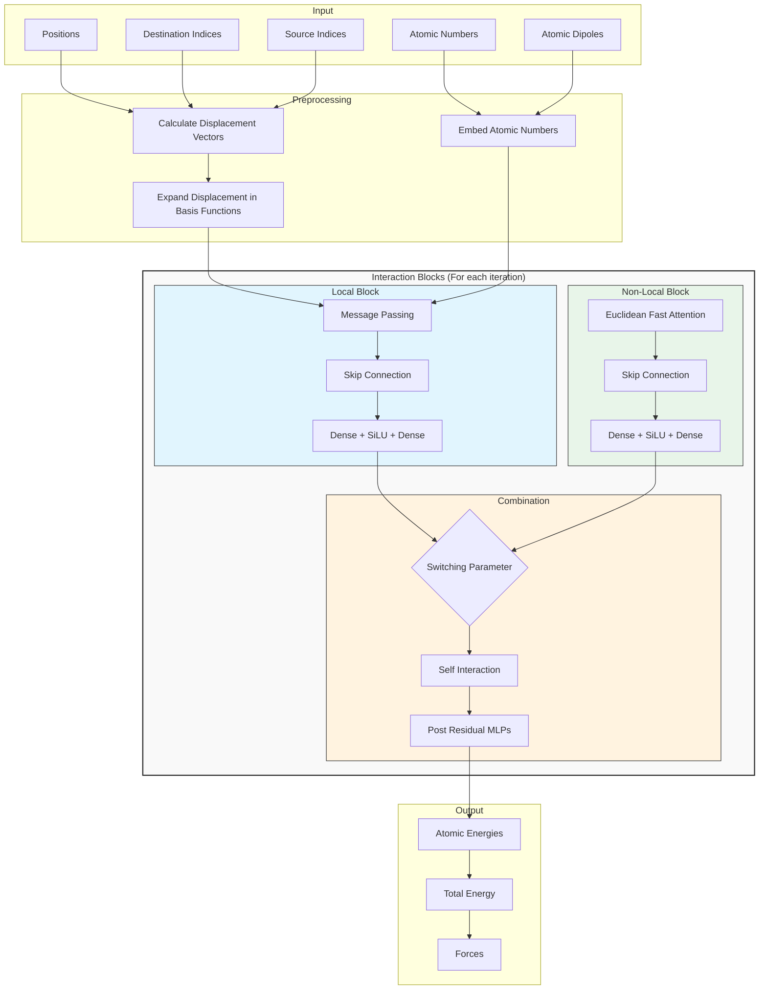
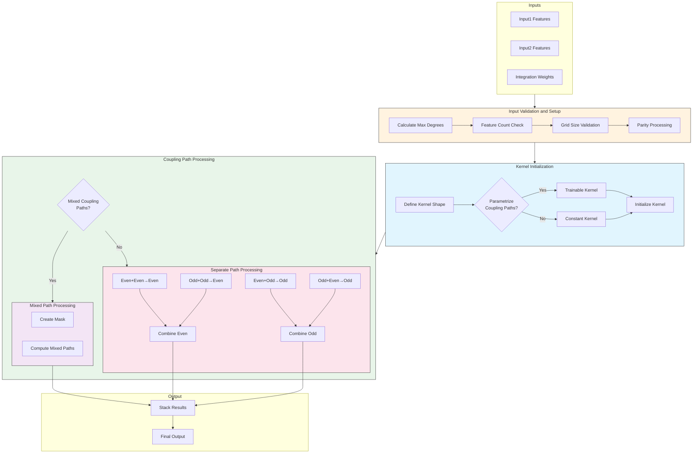

[](https://arxiv.org/abs/2412.08541)
[](https://doi.org/10.5281/zenodo.14750286)



### Euclidean Fast Attention

Reference implementation of the Euclidean fast attention (EFA) algorithm, presented in the paper
[*Euclidean Fast Attention: Machine Learning Global Atomic Representations at Linear Cost*](https://arxiv.org/abs/2412.08541).

#### Installation

The code in this repository can be either used with CPU or with GPU. If you want to use GPU, you have to install the
corresponding JAX installation via

```shell script
# On GPU
pip install --upgrade pip
pip install "jax[cuda12]"
```

If you want to run the code on CPU, e.g. for testing on your local machine which does not have a GPU, you can do

```shell script
# On CPU
pip install --upgrade pip
pip install jax
```

Note, that the code will run much fast on GPU than on CPU, so training is ideally performed on a GPU. More
details about JAX installation can be found [here](https://jax.readthedocs.io/en/latest/installation.html).

Afterwards, you clone the EFA repository and install via

```shell script
# Euclidean fast attention installation
git clone https://github.com/thorben-frank/euclidean_fast_attention.git
cd euclidean_fast_attention
pip install .
```

#### Examples

For example usages check the `examples/` folder. It contains an examples for basic usage of the `EuclideanFastAttention`
`flax` module. Additionally, you can find examples on how to train an O(3) equivariant MPNN with enabled / disabled
EFA block to reproduce the results from the paper.

### Datasets

A few data sets that are used throughout the examples are included here in the repository under the `datasets` folder.
All datasets can be found in the corresponding [zenodo repository](https://doi.org/10.5281/zenodo.14750286).

## General overview

At the highest level, the **O(3) Equivariant MPNN** serves as the application-layer architecture, integrating both local message passing and global attention mechanisms for molecular property prediction. This network strategically incorporates **Euclidean Fast Attention (EFA)** blocks to handle long-range interactions at linear cost while maintaining SO(3) equivariance through learnable rotary position embeddings (RoPE). The EFA module itself decomposes into two core components: the **Euclidean RoPE Attention** mechanism that implements rotation-equivariant attention using spherical quadrature, and the **Tensor Integration** module that enables higher-order geometric feature interactions through optimized tensor product operations. These modules collectively leverage Lebedev grid integration and spherical harmonic expansions to preserve geometric integrity while achieving computational efficiency.

### Module: Euclidean Fast Attention

#### Overview

The EuclideanFastAttention module implements an equivariant attention mechanism that combines rotary position embeddings with tensor integration for processing molecular structures. It maintains SO(3) equivariance while capturing global interactions between atoms.



#### Technical Details

##### Core Components

1. **Input Processing**

   ```python
   def __call__(self,
       inputs: Array,          # (num_nodes, 1/2, (max_degree + 1)^2, num_features)
       positions: Array,       # (num_nodes, 3)
       batch_segments: Array,  # (num_nodes)
       graph_mask: Array       # (num_graphs)
   )
   ```

2. **Feature Projection**
   - Optional parametrized projections for Q/K/V
   - Configurable feature dimensions
   - Degree control for each component

3. **Lebedev Grid Integration**
   - Configurable number of grid points
   - Automatic weight generation
   - Spherical harmonic expansion

##### Key Features

1. **Frequency Management**

   ```python
   frequencies = frequency_init_fn(
       rng,
       num_frequencies,
       num_features,
       max_frequency,
       max_length,
       dtype
   )
   ```

   - Linear or trainable frequency distribution
   - Configurable max frequency and length
   - Automatic scaling for grid compatibility

2. **Tensor Integration Options**
   - Optional tensor product integration
   - Configurable maximum spherical degree
   - Parametrizable coupling paths
   - Degree scaling support

##### Implementation Details

1. **Parameter Configuration**

   ```python
   class EuclideanFastAttention(nn.Module):
       lebedev_num: int = 6
       parametrized: bool = True
       num_features_qk: Optional[int] = None
       max_degree_qk: Optional[int] = None
       # ... additional parameters
   ```

2. **Processing Pipeline**
   - Feature dimension validation
   - Degree extraction and validation
   - Grid point generation
   - Attention computation
   - Optional tensor integration

##### Mathematical Foundation

1. **Attention Mechanism**

   ```text
   β = ∫_S² Attention(RoPE(Q), RoPE(K), V) dΩ
   ```

2. **Tensor Integration**

   ```text
   Output = ∫_S² T(Y_L(u), β(u)) w(u) du
   ```

   Where:
   - Y_L: Spherical harmonics
   - T: Tensor product
   - w(u): Integration weights

##### Usage Examples

```python
attention = EuclideanFastAttention(
    lebedev_num=146,
    parametrized=True,
    num_features_qk=32,
    tensor_integration=True,
    ti_max_degree_sph=2
)

output = attention(
    inputs=node_features,
    positions=atomic_positions,
    batch_segments=batch_ids,
    graph_mask=mask
)
```

##### Advanced Features

1. **Degree Control**
   - Independent Q/K and V degrees
   - Automatic degree inference
   - Pseudotensor handling

2. **Integration Options**
   - Direct numerical integration
   - Tensor product integration
   - Configurable coupling paths

3. **Batch Processing**
   - Efficient batch handling
   - Proper padding support
   - Graph masking

##### Performance Considerations

1. **Memory Usage**
   - Scales with Lebedev grid size
   - Affected by feature dimensions
   - Tensor integration overhead

2. **Computational Efficiency**
   - Optional parametrization
   - Optimized grid operations
   - Efficient batch processing

3. **Parameter Control**
   - Trainable frequencies option
   - Degree scaling constants
   - Coupling path parameters

##### Error Handling

The module includes comprehensive validation for:

- Tensor integration configuration
- Feature dimension compatibility
- Degree constraints
- Grid point requirements
- Batch structure validity

### Module: Euclidean RoPE Attention 

#### Overview

The Euclidean Rotary Position Embedding (RoPE) Attention module implements an equivariant attention mechanism that preserves SO(3) symmetry through rotary embeddings and numerical integration over spherical grids.



#### Technical Details

##### Input Structure

```python
def apply(q, k, v, pos, theta, grid_u, grid_w, batch_segments, graph_mask):
    """
    q: Query tensor (N, 1/2, (max_degree+1)^2, num_features)
    k: Key tensor (N, 1/2, (max_degree+1)^2, num_features)
    v: Value tensor (N, 1/2, (max_degree+1)^2, num_features)
    pos: Position vectors (N, dim)
    theta: RoPE frequencies (num_features/2)
    grid_u: Lebedev grid points (M, dim)
    grid_w: Integration weights (M)
    """
```

##### Key Components

1. **Preprocessing**
   - Degree validation and adjustment
   - Pseudotensor handling
   - Maximum degree constraints
   - Shape compatibility checks

2. **Rotary Position Embedding**

   ```python
   # Position projection
   x = jnp.einsum("nd,md->nm", pos, grid_u)
   
   # RoPE calculation
   sin, cos = calculate_rotary_position_embedding(x, theta)
   
   # Apply embeddings
   q = apply_rotary_position_embedding(q, sin, cos)
   k = apply_rotary_position_embedding(k, sin, cos)
   ```

3. **Attention Mechanism**
   - Feature space reshaping
   - Query scaling for variance control
   - Batched key-value outer products
   - Structure-wise summation
   - Integration over spherical grid

##### Mathematical Foundation

The module implements equivariant attention through:

1. **Rotary Embeddings**:

   ```text
   RoPE(x, θ) = [x_i·cos(θ_i) - x_{i+1}·sin(θ_i), x_i·sin(θ_i) + x_{i+1}·cos(θ_i)]
   ```

2. **Attention Operation**:

   ```text
   Attention(Q, K, V) = ∫_S² softmax(Q·K^T/√d)V dΩ
   ```

##### Implementation Features

1. **Equivariance Preservation**
   - SO(3) equivariant attention mechanism
   - Proper handling of pseudotensors
   - Degree-wise feature processing

2. **Performance Optimizations**
   - Efficient einsum operations
   - Memory-efficient batch processing
   - Optional integration deferral
   - Smart reshaping for computational efficiency

3. **Flexibility**
   - Configurable maximum degrees
   - Optional pseudotensor handling
   - Adaptable frequency parameters
   - Support for single and multi-molecule batches

##### Lebedev Grid Configuration

```python
LEBEDEV_FREQUENCY_LOOKUP = {
    50: np.pi,
    86: 2 * np.pi,
    110: 2.5 * np.pi,
    # ... more grid points
}
```

##### Usage Example

```python
# Initialize parameters
q = initialize_query(...)
k = initialize_key(...)
v = initialize_value(...)
pos = get_positions(...)

# Apply attention
output = apply(
    q, k, v, pos,
    theta=frequencies,
    grid_u=lebedev_points,
    grid_w=lebedev_weights,
    batch_segments=segments,
    graph_mask=mask
)
```

##### Key Features

1. **Batch Processing**
   - Supports single and multiple molecules
   - Efficient memory handling for batch operations
   - Proper segmentation of molecular structures

2. **Grid Integration**
   - Lebedev quadrature for spherical integration
   - Configurable grid resolution
   - Optional deferred integration

3. **Shape Management**
   - Flexible tensor reshaping
   - Proper handling of parity channels
   - Automatic degree adjustment

##### Performance Considerations

- Memory usage scales with grid size
- Computational complexity depends on:

  - Number of grid points
  - Feature dimensionality
  - Maximum tensor degree
  - Batch size

### Error Handling

The module includes comprehensive error checking for:
- Degree compatibility
- Shape consistency
- Pseudotensor presence
- Dimensional constraints

### Module: O(3) Equivariant Message Passing Neural Network with EFA Blocks

#### Architecture Overview

This model implements an O(3) equivariant Message Passing Neural Network (MPNN) for energy and force prediction in molecular systems. The architecture combines local message passing with non-local interactions through Euclidean Fast Attention (EFA) blocks.



##### Key Components

1. **Input Processing**
   - Takes atomic numbers, positions, atomic dipoles, and graph connectivity (source/destination indices)
   - Calculates displacement vectors between connected atoms
   - Expands displacements in basis functions using radial basis functions and spherical harmonics
   - Embeds atomic numbers into feature space

2. **Interaction Blocks**
   Each iteration consists of:

   a) **Local Block (Message Passing)**
      - Performs O(3) equivariant message passing between connected atoms
      - Includes skip connections
      - Applies atom-wise refinement through MLPs
      - Final iteration only produces scalar features for efficiency

   b) **Non-Local Block (EFA)**
      - Optional Euclidean Fast Attention mechanism
      - Handles long-range interactions
      - Uses rotational positional encodings
      - Includes tensor integration for higher-order geometric features
      - Can be emulated for ablation studies

   c) **Combination and Refinement**
      - Trainable switching parameter between local and non-local features
      - Optional self-interaction through tensor products
      - Post-residual MLPs for further refinement

3. **Output Generation**
   - Predicts atomic energies through a final dense layer
   - Includes element-specific bias terms
   - Aggregates atomic energies to total molecular energy
   - Computes forces as negative gradients of energy w.r.t. positions

##### Key Features

- **O(3) Equivariance**: Maintains rotational and translational invariance throughout
- **Flexible Architecture**: Can be used with or without EFA blocks
- **Atomic Dipole Support**: Optional initialization with atomic dipole features
- **Customizable Depth**: Configurable number of interaction blocks and post-residual MLPs
- **Basis Function Options**: Multiple radial basis function choices and cutoff functions
- **Force Prediction**: Built-in force computation through automatic differentiation

##### Implementation Details

- Uses JAX/Flax for efficient computation and automatic differentiation
- Implements custom tensor operations through the e3x library
- Supports batch processing with proper masking for different-sized molecules
- Provides options for zero-initialization of output layers

##### Usage Notes

- Set `era_use_in_iterations` to control which iterations use EFA blocks
- Adjust `num_features` and degrees for performance vs accuracy trade-off
- Use `atomic_dipole_embedding` for systems where atomic dipoles are important
- Control local vs non-local contribution balance through `use_switch` parameter
- Set appropriate cutoff values based on your molecular system

### Module: Tensor Integration 



#### Overview

The TensorIntegration module implements a crucial component for handling tensor products of equivariant representations in SO(3)/O(3) neural networks. This module performs numerical integration over grid points to compute tensor products while maintaining equivariance.

#### Technical Details

##### Input Structure
- **inputs1**: First tensor with shape `[... K 1/2 (max_degree1+1)^2 num_features]`
- **inputs2**: Second tensor with shape `[... K 1/2 (max_degree2+1)^2 num_features]`
- **integration_weights**: Weights for numerical integration over grid points

##### Key Components

1. **Degree Processing**
   - Extracts and validates maximum degrees from input tensors
   - Ensures output degree doesn't exceed sum of input degrees
   - Handles both scalar and higher-order tensor representations

2. **Kernel Management**
   ```python
   kernel_shape = (
       num_parity1,
       max_degree1 + 1,
       num_parity2,
       max_degree2 + 1,
       num_parity3,
       max_degree3 + 1,
       features,
   )
   ```
   - Supports trainable or constant kernels
   - Handles parity channels for pseudotensors
   - Implements proper shape expansion for broadcasting

3. **Coupling Path Processing**
   - **Mixed Coupling Paths**:
     - Handles cases where inputs/outputs have different parity structures
     - Uses masked computations for forbidden coupling paths
   
   - **Separate Coupling Paths**:
     - Optimized processing for consistent parity structures
     - Four fundamental coupling operations:
       - Even + Even → Even
       - Odd + Odd → Even
       - Even + Odd → Odd
       - Odd + Even → Odd

##### Mathematical Foundation

The module implements the tensor product integration:

```text
∫ (input1(x) ⊗ input2(x)) dx ≈ Σᵢ wᵢ (input1(xᵢ) ⊗ input2(xᵢ))
```

Where:
- `xᵢ` are grid points
- `wᵢ` are integration weights
- `⊗` denotes the SO(3)-equivariant tensor product

##### Implementation Features

1. **Equivariance Preservation**
   - Maintains SO(3)/O(3) equivariance throughout computation
   - Handles both proper rotations and improper rotations (if including pseudotensors)

2. **Performance Optimizations**
   - Efficient handling of different parity cases
   - Optimized einsum operations for tensor contractions
   - Smart branching between mixed and separate coupling paths

3. **Flexibility**
   - Configurable maximum degree
   - Optional pseudotensor support
   - Adaptable precision and dtype settings
   - Support for trainable coupling paths

##### Usage Notes

```python
tensor_integration = TensorIntegration(
    max_degree=2,
    include_pseudotensors=True,
    parametrize_coupling_paths=False
)

output = tensor_integration(
    inputs1,
    inputs2,
    integration_weights
)
```

##### Key Parameters

- **max_degree**: Maximum degree of output tensors
- **include_pseudotensors**: Toggle for pseudotensor support
- **parametrize_coupling_paths**: Enable trainable coupling paths
- **precision**: Control numerical precision of computations
- **dtype**: Specify computation dtype
- **kernel_init**: Custom kernel initialization function

##### Validation and Error Handling

The module performs extensive input validation:
- Feature dimension matching
- Grid size consistency
- Maximum degree constraints
- Parity channel compatibility

#### Citation

If you find this repository useful or use the Euclidean fast attention algorithm in your research please
consider citing the corresponding paper

```bibtex
@article{frank2024euclidean,
  title={Euclidean Fast Attention: Machine Learning Global Atomic Representations at Linear Cost},
  author={Frank, J Thorben and Chmiela, Stefan and M{\"u}ller, Klaus-Robert and Unke, Oliver T},
  journal={arXiv preprint arXiv:2412.08541},
  year={2024}
}
```
